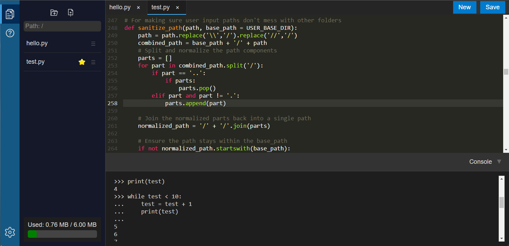

# TartLab
Lite web-based MicroPython IDE for embedded devices.

**Warning! This is currently in the alpha stage.  Nothing is guaranteed to work.**

## Goals
The primary goal of this project is to enable embedded device programming with MicroPython in a classroom setting while allowing the students to bring their own laptops, tablets, etc.  Trying to install USB drivers and applications (such as the Arduino IDE) becomes impractical for larger class sizes, and introduces many unnecessary complications to what should otherwise be fairly simple.

Since many embedded devices have WiFi connectivity built in, why not serve a tiny web-based IDE directly from the device?  Once set up, the IDE can be used without the need for any particular drivers, applications, or operating systems.  It can be accessed from any browser, from desktop PCs and Macs to Chromebooks, tablets, or phones.  The files are loaded and saved directly on the embedded device.

Additionally, it would be great if a community of MicroPython developers would get their start on TartLab and then continue to improve it for others.

## Features
 * Works with any modern web browser
 * Python code highlighting
 * REPL-like console

## Requirements
 * Embedded module: Must be able to run MicroPython and have WiFi  (See below for more details.)
 * LCD display (unless you really like pain)
 * Embedded storage: 4MB+ recommended
 * Client device (for development): Any device with a relatively modern browser (keyboard recommended)

## Recommended embedded devices
Any device using an ESP32 or ESP8266 processor and providing WiFi support should work.  I haven't tested with RP2040/RP2350 devices, but they should be able to be supported as well.  Devices with LCD screens are not actually required, but it should make your life so much easier.
LilyGo devices (T-Display-S3, T-Display-S3 Pro) were used to test and develop TartLab, so those should work great.

## Screenshots
**TartLab in action:**

## Installation
 1. Install a bin file from [MicroPython](https://micropython.org/) on the embedded device.  Sometimes there are special builds of MicroPython that are specific to your device, in which case you should use those.  For those devices without a special build, find the closest thing.  For example, the T-Display-S3 would use the "Support for Octal-SPIRAM" version of the [ESP32_GENERIC_S3 port.](https://www.micropython.org/download/ESP32_GENERIC_S3/)
 2. Edit src/hdwconfig.py to point to one of the available config files in src/configs, based on what embedded device you are using. (Default is Lilygo T-Display-S3 Pro.)
 3. Execute makedist.py to build TartLab.  The output is a new "dist" folder.
 4. Use [mpsync](https://github.com/tdhoward/mpsync) to load the TartLab "dist" files onto the device.
 5. Restart the device and enjoy!

## Operation
### Startup modes
There are two different modes of operation:
 * Normal operation: On power up, the device will begin serving the TartLab IDE.
 * User app operation:  If the device is powered up or reset while holding down the app button (IO12 on the T-Display-S3 Pro), the device will begin to execute the user's selected Python app.

### Connecting to the IDE
If the device cannot connect to a WiFi access point (for example, the first time you start it) it will create its own "soft access point" that you can connect to for configuration (or normal usage, if you prefer).  The temporary WiFi access point will be named PyAdjectiveAnimalNumber, which is randomly generated and assigned on the first startup.  If you are connected to the temporary WiFi access point, navigate to 192.168.4.1 to access the IDE.  If the device is connecting to a different WiFi access point that you have set up (see below), you can navigate to http://tartlab.local or its IP address from a browser.
The display should indicate which WiFi access point it is either creating or using, and what address you should enter in your browser.  Be sure your tablet or laptop is on the same WiFi network before typing in the address.

### Setting up WiFi access points
From the IDE, click the gear icon and select WiFi Settings.  This dialog will show you any stored WiFi access points, as well as allowing you to add new access points.  It will display the SSIDs that were discovered during the startup scan.  Note: Most embedded devices only support 2.4GHz WiFi connections, and therefore will only show them in the list of scanned access points.

### Updates
TartLab is updated every so often to include more examples, fix bugs, and make improvements.  If the device is connected to an internet-linked WiFi access point, you can check for updates through the TartLab interface.  Click on the gear icon, and select "Check for updates".  During the update process, it is best to have the device plugged in to make sure it stays on.  Wait until the update process is complete before doing anything else in TartLab.

### Feedback
Please feel free to add new issues if you are experiencing problems.  I will try to respond as soon as I can.
