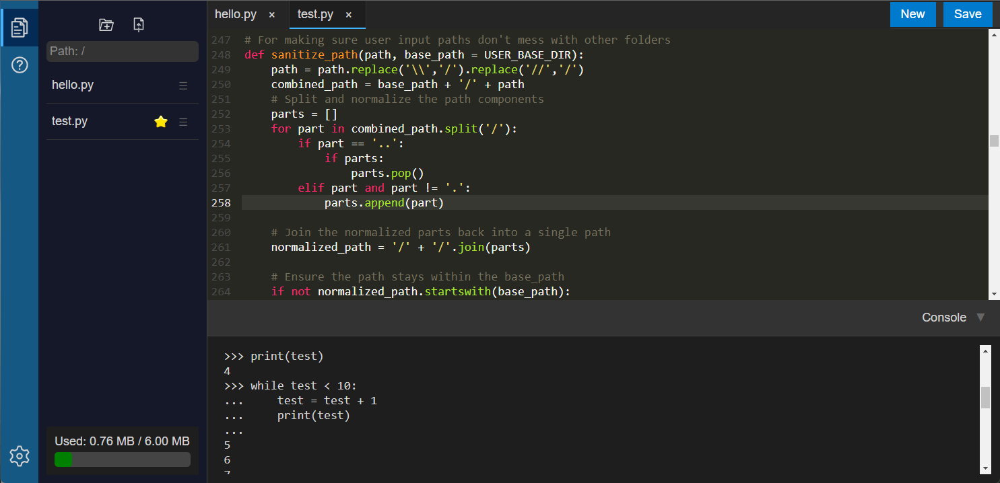

# TartLab
Lite web-based MicroPython IDE for embedded devices.

For source-development prerequisites, clean setup, build and test commands,
local credentials, and optional physical-board tooling, see
[`DEVELOPMENT.md`](DEVELOPMENT.md).


**Warning! This is currently in the alpha stage.  Nothing is guaranteed to work.**

## Goals
The primary goal of this project is to enable embedded device programming with MicroPython in a classroom setting while allowing the students to bring their own laptops, tablets, etc.  Trying to install USB drivers and applications (such as the Arduino IDE) becomes impractical for larger class sizes, and introduces many unnecessary complications to what should otherwise be fairly simple.

Since many embedded devices have WiFi connectivity built in, why not serve a tiny web-based IDE directly from the device?  Once set up, the IDE can be used without the need for any particular drivers, applications, or operating systems.  It can be accessed from any browser, from desktop PCs and Macs to Chromebooks, tablets, or phones.  The files are loaded and saved directly on the embedded device.

Additionally, it would be great if a community of MicroPython developers would get their start on TartLab and then continue to improve it for others.

## Features
 * Works with any modern web browser
 * Python code highlighting
 * REPL-like console

## Requirements
 * Embedded module: Must be able to run MicroPython and have WiFi  (See below for more details.)
 * LCD display (unless you really like pain)
 * Embedded storage: 4MB+ recommended
 * Client device (for development): Any device with a relatively modern browser (keyboard recommended)

## Recommended embedded devices
TartLab is intended to support multiple Wi-Fi-capable MicroPython devices, but
the currently qualified legacy release profile is specifically the LilyGO
T-Display-S3 Pro running the exact MicroPython image listed below. LilyGO
T-Display-S3 devices have also been used during development. Other ESP32,
ESP8266, and RP2040/RP2350 targets should be treated as ports requiring their
own board adapter and test results, not as already-qualified devices. A display
is not structurally required, although it makes standalone operation much more
usable.

## Screenshots
**TartLab in action:**



## Installation
 1. Install a bin file from [MicroPython](https://micropython.org/) on the embedded device.  Sometimes there are special builds of MicroPython that are specific to your device, in which case you should use those.  For the deployed T-Display-S3/T-Display-S3 Pro compatibility baseline, use MicroPython 1.23.0 with octal PSRAM support: `ESP32_GENERIC_S3-SPIRAM_OCT-20240602-v1.23.0.bin` from the [ESP32_GENERIC_S3 port.](https://www.micropython.org/download/ESP32_GENERIC_S3/)  Do not substitute the non-SPIRAM or quad-SPIRAM variant for these devices.
 2. Before first provisioning, edit `src/hdwconfig.py` to point to one of the
    available modules in `src/configs` for your device. The default is the
    LilyGO T-Display-S3 Pro. After first boot, TartLab migrates the selection to
    protected `/device/hdwconfig.py`; OTA updates preserve that local choice.
 3. Install the pinned host build dependency with
    `python -m pip install --require-hashes -r requirements-build.txt`, run
    `npm ci --prefix src/ide/www`, then execute
    `python makedist.py --clean`. The output is a newly recreated `dist`
    directory; the command never reuses stale output.
 4. Use [mpsync](https://github.com/tdhoward/mpsync) to load the TartLab "dist" files onto the device.
 5. Restart the device and enjoy!

## Operation
### Startup modes
There are two different modes of operation:
 * Normal operation: On power up, the device will begin serving the TartLab IDE.
 * User app operation:  If the device is powered up or reset while holding down the app button (IO12 on the T-Display-S3 Pro), the device will begin to execute the user's selected Python app.

### Connecting to the IDE
If the device cannot connect to a WiFi access point (for example, the first time you start it) it will create its own "soft access point" that you can connect to for configuration (or normal usage, if you prefer).  The temporary WiFi access point will be named PyAdjectiveAnimalNumber, which is randomly generated and assigned on the first startup.  If you are connected to the temporary WiFi access point, navigate to 192.168.4.1 to access the IDE.  If the device is connecting to a different WiFi access point that you have set up (see below), you can navigate to http://tartlab.local or its IP address from a browser.
The display should indicate which WiFi access point it is either creating or using, and what address you should enter in your browser.  Be sure your tablet or laptop is on the same WiFi network before typing in the address.

### Setting up WiFi access points
From the IDE, click the gear icon and select WiFi Settings.  This dialog will show you any stored WiFi access points, as well as allowing you to add new access points.  It will display the SSIDs that were discovered during the startup scan.  Note: Most embedded devices only support 2.4GHz WiFi connections, and therefore will only show them in the list of scanned access points.

### Updates
TartLab is updated every so often to include more examples, fix bugs, and make
improvements. If the device is connected to an internet-linked WiFi access
point, you can check for updates through the TartLab interface. Click on the
gear icon, and select "Check for updates". One update takes the device directly
to the latest stable release; you do not need to find or install intermediate
versions. TartLab may perform several internal migration steps or automatic
restarts as part of that one update. During the update process, it is best to
have the device plugged in to make sure it stays on. Wait until the update
process is complete before doing anything else in TartLab, and do not start
"Check for updates" again while an update is being resumed.

## Reproducible legacy releases

The `legacy-mp123` release profile is the compatibility path for deployed
T-Display-S3 Pro devices using the exact MicroPython 1.23.0 octal-SPIRAM image
listed above. Use a compatible Python (`>=3.10,<3.15`) and Node.js 20 or newer,
then build it noninteractively from a clean checkout. The
`python-minifier==3.2.0` build dependency and npm dependency graph remain
locked because they directly affect the payload:

```text
python -m pip install --require-hashes -r requirements-build.txt
npm ci --prefix src/ide/www
npm run build --prefix src/ide/www
python makedist.py --output build/legacy/dist --clean --skip-web-build
python release.py --dist build/legacy/dist --output build/legacy/release --clean --version vX.Y
python tools/check_legacy_release.py --dist build/legacy/dist --release build/legacy/release
python tools/pydevices_upstream.py
```

The separate Phase 4 migration candidate can be generated without changing the
legacy release source:

```text
python tools/vendor_pydevices.py --fetch --output build/vendor/pydevices-candidate --clean
```

That candidate is pinned and reproducible. Its minimal legacy import/API
adapters and retained QOI reader are validated on the host and by the pinned
MicroPython 1.23 compatibility tier, but it remains research-only until the
Phase 4 physical-device comparison and promotion gates are complete.

For a physical comparison only, overlay the generated tree on an already-built
legacy distribution with the guarded research builder:

```text
python tools/build_phase4_test_release.py --base-dist build/legacy/dist --candidate build/vendor/pydevices-candidate --output build/phase4/candidate --version descriptive-research-version --clean
```

The result is minified with the legacy toolchain and explicitly marked
`research-only-not-for-promotion`. It cannot substitute for the normal legacy
release path. The current physical findings and remaining gates are recorded in
`tests/PHASE4_HARDWARE.md`.

`release.py` keeps `manifest.json` compatible with the deployed updater and
adds deterministic USTAR archives, file/archive inventories, checksums, size
budgets, firmware compatibility, Git/build identity, and the locked legacy
vendor-payload identifier. `SOURCE_DATE_EPOCH` may be supplied explicitly; it
defaults to the current Git commit timestamp.

Pull requests and pushes run the same build twice and require byte-identical
release directories. CI artifacts are candidates only. Stable promotion is a
separate reviewed workflow gated by the physical-device checklist in
`tests/PHASE2_HARDWARE.md` and the protected `legacy-release` GitHub
environment.

## Testing

TartLab separates fast host checks from physical-device qualification. Run the
complete implemented hardware-free suite with:

```text
python -m unittest tests.test_phase1 tests.test_phase2 tests.test_phase4 tests.test_virtual_device tests.test_platform tests.test_headless_ide -v
```

The suite covers deterministic releases, the captured legacy layout, OTA and
recovery fault handling, a virtual device filesystem, startup mode routing,
headless IDE initialization, and the reviewed PyDevices import/payload
inventory. CI additionally compiles the generated runtime, verifies the built
vendor payload against that allowlist, and executes its platform-independent
compatibility probe with pinned MicroPython v1.23.0 host tools. The exact tier
boundaries, local Tier 2 command, and current limitations are documented in
[`tests/TEST_TIERS.md`](tests/TEST_TIERS.md). Passing host tests does not replace
the applicable physical smoke or release-qualification gate.

### Feedback
Please feel free to add new issues if you are experiencing problems.  I will try to respond as soon as I can.
